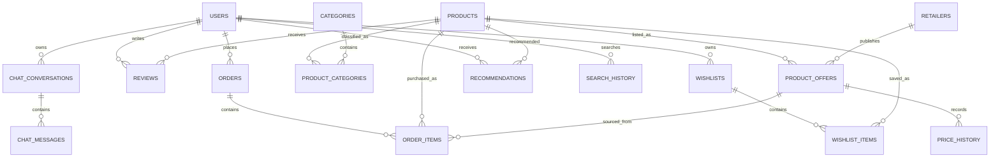

# Scalable PostgreSQL Design

The schema is normalized to third normal form (3NF): a fact has one source of truth, many-to-many relationships use bridge tables, and time-varying facts are append-only. UUIDs support distributed writers, all timestamps are `timestamptz` (UTC), and money is stored in integer minor units—not floats.

## ER diagram

## Tables and relationships

| Table | Responsibility | Key relationships |
| --- | --- | --- |
| `users` | Identity and authorization state | Owns wishlists, orders, reviews, recommendations, searches, chats |
| `products` | Canonical product identity | Has categories, retailer offers, reviews, order items |
| `categories` / `product_categories` | Reusable taxonomy and product-to-category many-to-many relation | Prevents repeating category strings as the taxonomy grows |
| `retailers` / `product_offers` | A retailer-specific sellable listing | An offer has a unique external retailer listing and append-only prices |
| `reviews` | One user review per product | `UNIQUE(user_id, product_id)`, rating 1–5, visibility moderation flag |
| `wishlists` / `wishlist_items` | User-owned saved products and optional target price | `UNIQUE(wishlist_id, product_id)` prevents duplicates |
| `orders` / `order_items` | Transactional purchase record and immutable line-item snapshot | Product title/price snapshots preserve historical order truth |
| `price_history` | Immutable offer price/availability observation | Unique `(offer_id, observed_at)` and no update columns by design |
| `recommendations` | Per-user ranked results from AI/rules | Unique per user/product/reason; score constrained to 0–1 |
| `search_history` | Query analytics and personalization signal | Optional user supports anonymous searches; JSONB filters preserve flexible facets |
| `chat_conversations` / `chat_messages` | Private, ordered shopping-copilot transcript | Messages cascade on conversation deletion |

## Indexes and why they exist

- Primary-key UUID indexes support joins and direct resource lookup.
- `users.email`, `categories.slug`, `retailers.code`, `orders.order_number`, and retailer listing IDs are unique natural-key lookup paths.
- Composite ownership indexes such as `orders(user_id, created_at DESC)`, `search_history(user_id, searched_at DESC)`, and `chat_conversations(user_id, last_message_at DESC)` serve the common “my recent data” queries.
- `price_history(offer_id, observed_at DESC)` serves product price charts without scanning all history.
- `product_offers(product_id, current_price_minor)` supports lowest-price comparison.
- `reviews(product_id, is_visible, created_at DESC)` serves public product reviews while excluding hidden content.
- A GIN index on `search_history.filters` supports JSONB analytics queries. Add full-text GIN indexes to `products` only after measuring search load.

## Constraints and integrity

- Foreign keys express ownership and prevent orphan data; `CASCADE` is used only for user-private data, while purchase history uses `RESTRICT` to avoid accidental financial-record loss.
- Check constraints protect rating ranges, positive quantities, nonnegative minor-unit money, valid ISO-style currency codes, nonempty text, and recommendation score ranges.
- Status, recommendation reason, and chat role use PostgreSQL enums for a finite, validated lifecycle.
- Unique constraints enforce one review per user/product, one wishlist membership per product, and one price observation at a given instant.

## Operational best practices

- Apply [0002_shopping_intelligence_schema.py](../migrations/versions/0002_shopping_intelligence_schema.py) with Alembic; never use `create_all` in production.
- Use parameterized SQLAlchemy queries, transaction boundaries per command, least-privilege roles, TLS for PostgreSQL, encrypted backups, and point-in-time recovery.
- Keep `price_history` append-only. At sustained high volume, partition it by monthly `observed_at` ranges, retain raw data by policy, and materialize daily aggregates for charts.
- Store credentials and payment-provider tokens outside this schema. Orders retain only business state and snapshots; use an external PCI-compliant payment service.
- Monitor slow-query plans, table/index bloat, connection saturation, replication lag, failed backups, and migration duration. Use PgBouncer for large API connection counts.
- Maintain backward-compatible, expand/contract migrations and verify every foreign-key/index addition against production table size before deployment.
